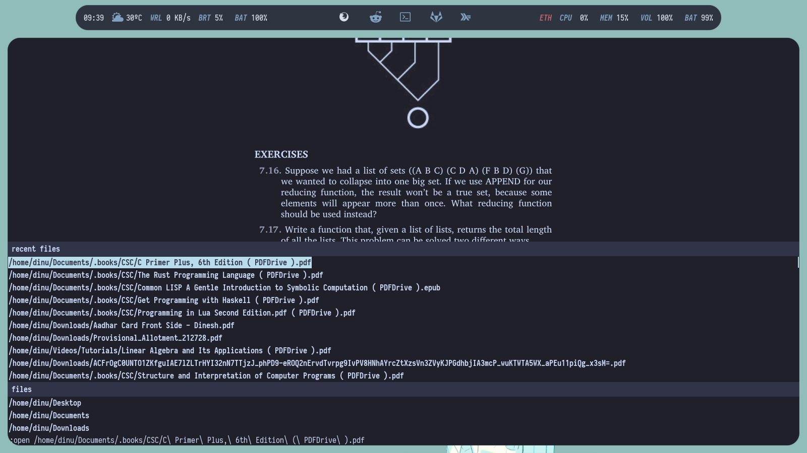

<p align="center">
    <a href="https://github.com/FrenzyExists" target="_blank">
        
    </a>
</p>
<p align="center">
    <a href="https://github.com/FrenzyExists/aquarium-vim/stargazers"></a>
    <a href="https://github.com/FrenzyExists/aquarium-vim/releases/latest"></a>
    <a href="https://github.com/FrenzyExists/aquarium-vim/issues"></a>
    <a href="https://github.com/FrenzyExists/aquarium-vim/network/members"></a>
</p>

<br/>

<p align="center">A colorful, dark cozy <a href="https://github.com/neovim/neovim">Neovim</a> colorscheme.</p>

<br/>

Terminal configurations are in [extras](https://github.com/FrenzyExists/aquarium-vim/tree/develop/extras) and at [my dotfiles](https://github.com/FrenzyExists/dotfiles), includes my [tmux](https://github.com/FrenzyExists/dotfiles/blob/master/config/.tmux.conf) config, partly ripped from [Hi I'm Bored](https://github.com/shaunsingh).

## Getting Started

### Quick Start

* vim-plug
```vim
Plug 'frenzyexists/aquarium-vim', { 'branch': 'develop' }
```

* packer
```lua
use 'frenzyexists/aquarium-vim'
```

* deim.vim
```vim
call dein#add('frenzyexists/aquarium-vim')
```

## Features 🎁
The vimscript version currently have some support for a few plugins, bellow a list of supported plugins:
- [pandoc](https://github.com/jgm/pandoc)
- [jedi](https://github.com/davidhalter/jedi)
- [Vim Clap](https://github.com/liuchengxu/vim-clap/tree/master/test)
- [fujitive.vim](https://github.com/tpope/vim-fugitive)
- [vim-sneak](https://github.com/justinmk/vim-sneak)
- [vim-airline](https://github.com/vim-airline/vim-airline)
- [lightline.vim](https://github.com/itchyny/lightline.vim)
- [lualine.nvim](https://github.com/nvim-lualine/lualine.nvim) _«requires neovim 5.0 or above»_
- [nvim-treesitter](https://github.com/nvim-treesitter/nvim-treesitter) _«requires neovim 5.0 or above»_
- [nvim-tree.lua](https://github.com/kyazdani42/nvim-tree.lua) _«requires neovim 5.0 or above»_

### Variables 🎯

Set Bold:
```vim
" On = 1 (default) | Off = 0
let g:aqua_bold = 1
```
Set Transparency
```vim
" On = 1 | Off = 0 (default)
let g:aqua_transparency = 1
```

### Modes 🧰
Aquarium now has Light Mode!

```vim
" To enable Lightmode change the style variable:

" options: "light", "dark"
let g:aquarium_style="dark"
```

### Airline ✈️
```vim
" Airline has two themes :D

" options:
"   base16_aquarium_light
"   base16_aquarium_dark
let g:airline_theme="base16_aquarium_light"
```

### Outside Vim/Neovim

Note: Copy the contents of the file to the respective config file of your
favorite terminal. Always check the docs of your terminal first!

#### Alacritty

* [General Theme](https://github.com/FrenzyExists/aquarium-vim/blob/develop/extras/terminal-themes/alacritty/alacritty_aquarium.yml) (All three themes are in a single file)

#### Kitty
* [Dark Theme](https://github.com/FrenzyExists/aquarium-vim/blob/develop/extras/terminal-themes/kitty/kitty_aquarium_dark.conf)
* [Light Theme](https://github.com/FrenzyExists/aquarium-vim/blob/develop/extras/terminal-themes/kitty/kitty_aquarium_light.conf)

#### St
* [Dark Theme](https://github.com/FrenzyExists/aquarium-vim/blob/develop/extras/terminal-themes/st/alacritty-dark.c)
* [Light Theme](https://github.com/FrenzyExists/aquarium-vim/blob/develop/extras/terminal-themes/st/alacritty-light.c)

#### Gnome Terminal
* [Dark Theme](https://github.com/FrenzyExists/aquarium-vim/blob/develop/extras/terminal-themes/gnome-terminal/aquarium-dark.sh)
* [Light Theme](https://github.com/FrenzyExists/aquarium-vim/blob/develop/extras/terminal-themes/gnome-terminal/aquarium-light.sh)

#### iTerm
* [Dark Theme](https://github.com/FrenzyExists/aquarium-vim/blob/develop/extras/terminal-themes/iterm/aquarium-dark.itermcolors)
* [Light Theme](https://github.com/FrenzyExists/aquarium-vim/blob/develop/extras/terminal-themes/iterm/aquarium-light.itermcolors)

### Screenshots 🖼️

### Theme on Neovim (with plugins)

#### Aquarium-Dark


#### Terminal View


#### Aquarium-Light


#### Terminal View


### Pallete 🎨
<p align="center">
    
</p>

## Other

### Zathura 📖


## Contributing 🚧
Aquarium is open-source, **Forever**

You could submit a [pull request](https://github.com/frenzyexists/aquarium-vim/pulls) or a [suggestion/enchantment](https://github.com/frenzyexists/aquarium-vim/issues) for this color theme.

you can also add a onfig of your favorite program using aquarium colors over [here](https://github.com/FrenzyExists/dotfiles).

<p align="center">
    <a href="https://github.com/frenzyexists/aquarium-vim/blob/main/LICENSE">
        
    </a>
</p>

