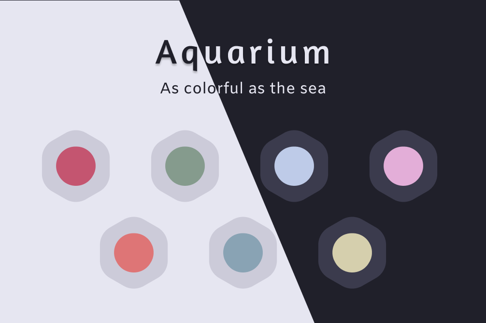
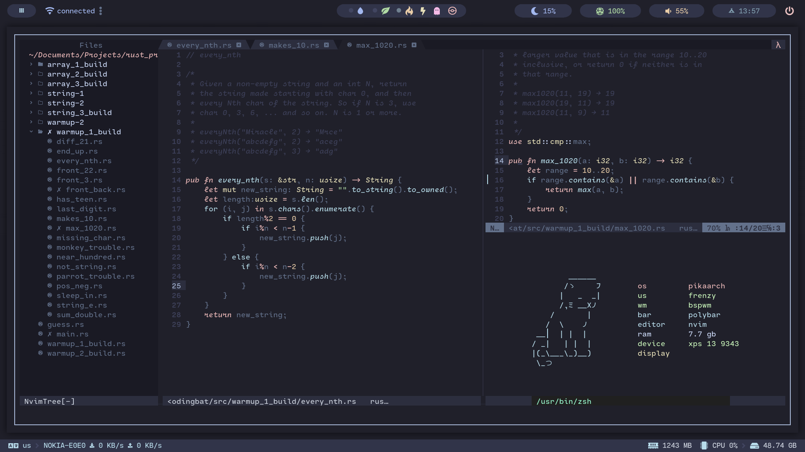
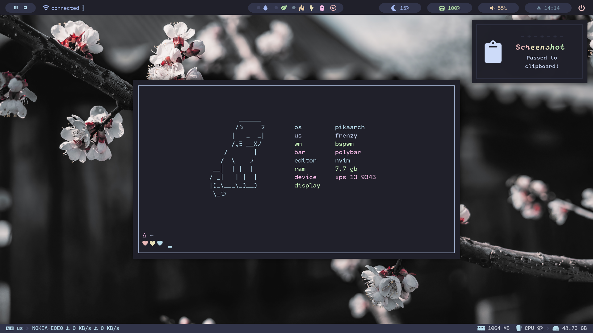
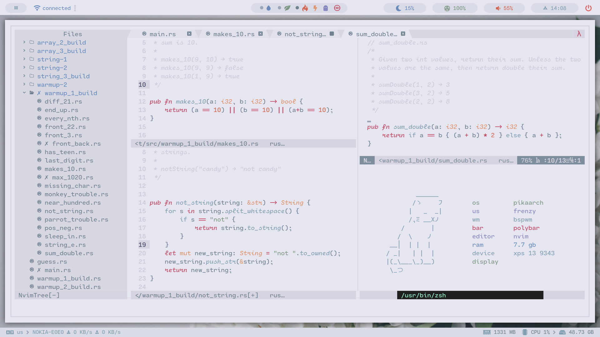
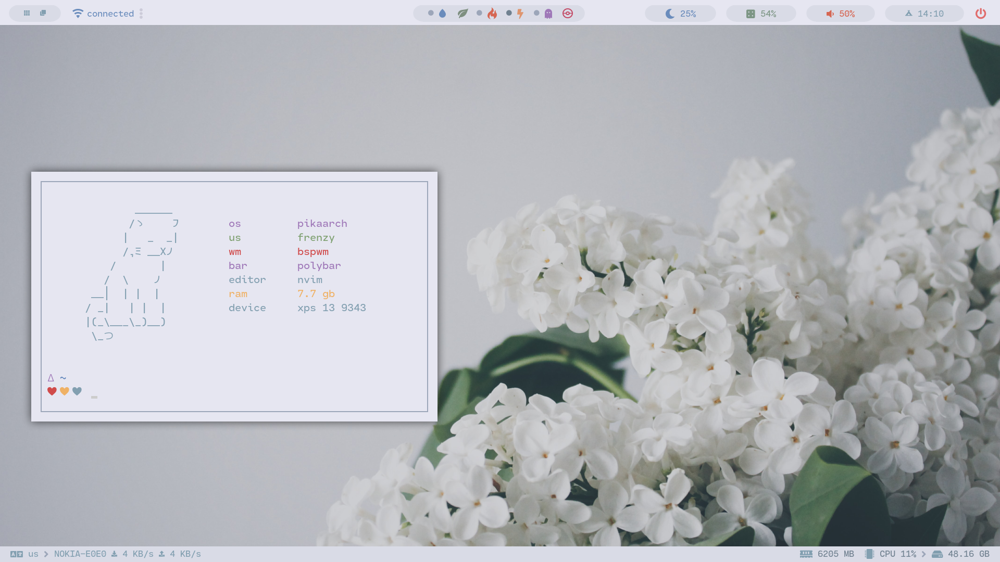
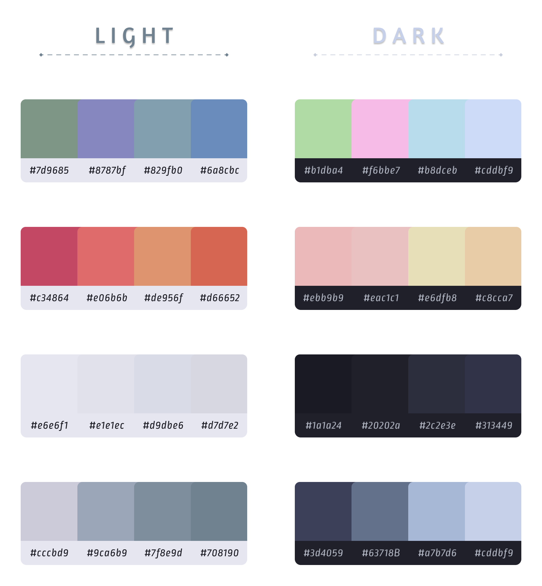

<p align="center">
    <a href="https://github.com/FrenzyExists" target="_blank">
        
    </a>
</p>
<p align="center">
    <a href="https://github.com/FrenzyExists/aquarium-vim/stargazers"></a>
    <a href="https://github.com/FrenzyExists/aquarium-vim/releases/latest"></a> 
    <a href="https://github.com/FrenzyExists/aquarium-vim/issues"></a>
    <a href="https://github.com/FrenzyExists/aquarium-vim/network/members"></a>
</p>

<br/>

<p align="center">A colorful, dark cozy <a href="https://github.com/neovim/neovim">Neovim</a> colorscheme.</p>

Currently aquarium is at a very early stage, there's a large need for ports. At the time of this writting, you can visit [my dotfiles](https://github.com/FrenzyExists/dotfiles) for terminal configurations as well as my [tmux](https://github.com/FrenzyExists/dotfiles/blob/master/config/.tmux.conf) config, which is partly ripped from [Hi I'm Bored](https://github.com/shaunsingh).

## Getting Started

### Quick Start

* vim-plug
```vim
Plug 'frenzyexists/aquarium-vim', { 'branch': 'develop' }

```

```
## Features and Stuff
The vimscript version currently have some support for a few plugins, bellow a list of supported plugins:
- [pandoc](https://github.com/jgm/pandoc)
- [jedi](https://github.com/davidhalter/jedi)
- [Vim Clap](https://github.com/liuchengxu/vim-clap/tree/master/test)
- [fujitive.vim](https://github.com/tpope/vim-fugitive)
- [vim-airline](https://github.com/vim-airline/vim-airline)

### Variables n Stuff
```vim
" Bold stuff
let g:aqua_bold = 1 
```

### Modes
Aquarium now has Light Mode!

```vim
" To enable Lightmode change the style variable:

" options: "light", "dark"
let g:aquarium_style="dark"
```

### Airline
```vim
" Airline has two themes :D

" options:
"   base16_aquarium_light
"   base16_aquarium_dark
let g:airline_theme="base16_aquarium_light"
```

### Screenshots

### Theme on PikaVim

#### Aquarium-Dark


#### Terminal View


#### Aquarium-Light


#### Terminal View


### Pallete
<p align="center">
    
</p>

## Contributing
Aquarium is open-source, and will always be forever and ever.

There's a lot of ways to contribute, creating ports in particular. For example, you could submit a [pull request](https://github.com/frenzyexists/aquarium-vim/pulls) a [suggestion/enchantment](https://github.com/frenzyexists/aquarium-vim/issues) for this color theme.

Other ways you can contribute is by adding a config of your favorite program using aquarium colors over [here](https://github.com/FrenzyExists/dotfiles).

### To-do list
- [x] Add Scheme switch script
- [ ] Glorify theme
- [ ] Add Mish Theme
- [ ] Profit (hehe)

<p align="center">
    <a href="https://github.com/frenzyexists/aquarium-vim/blob/main/LICENSE">
        
    </a>
</p>

